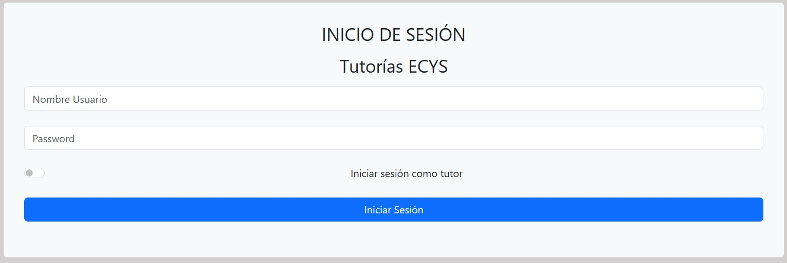
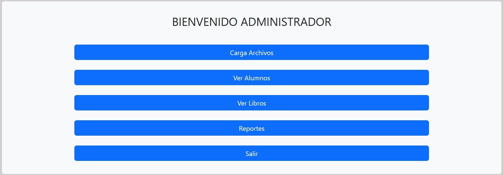
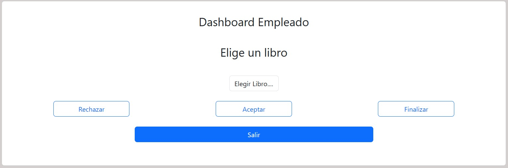
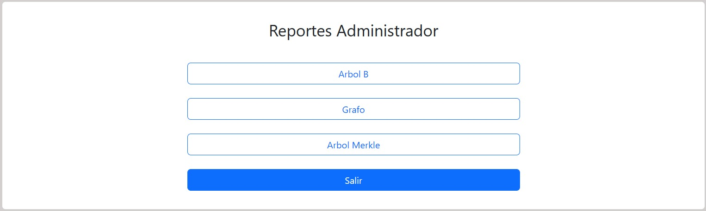
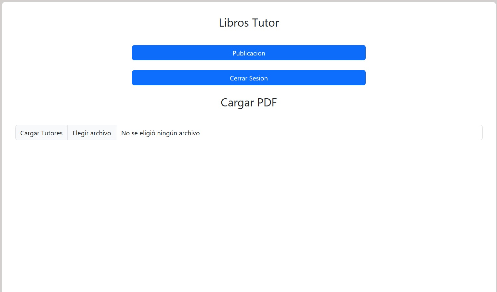
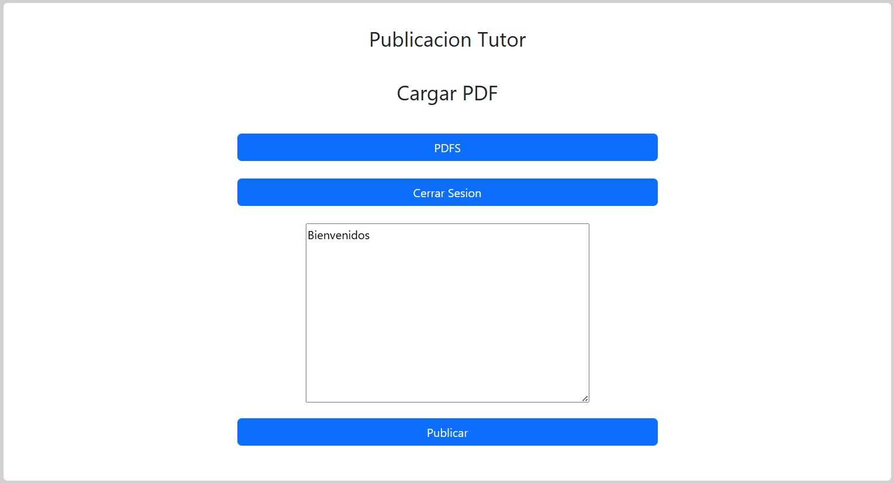
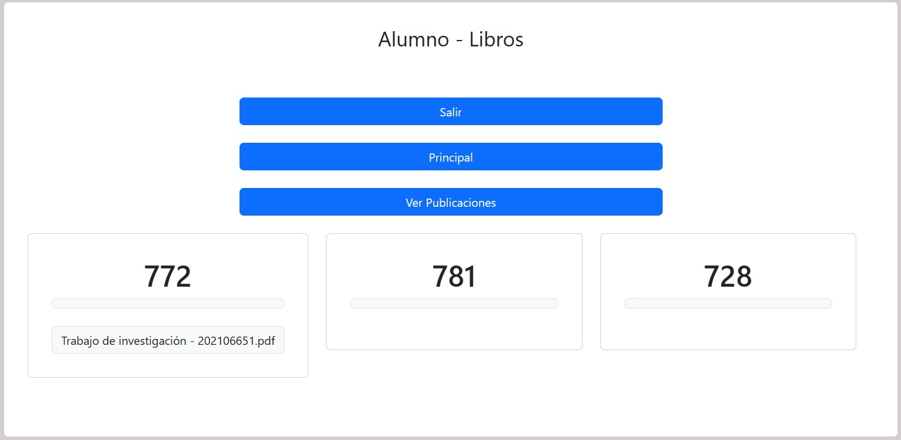
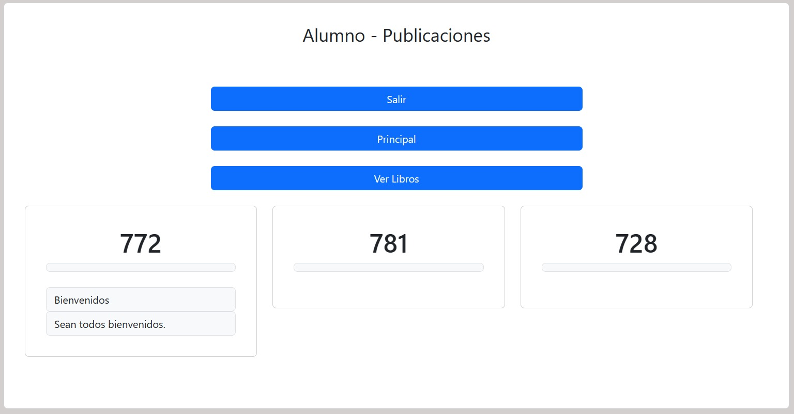

# MANUAL DE USUARIO
## Luis Carlos Corleto Marroquín
### Proyecto único - Tutorías ECYS
#### Menú sistema de inicio
El menú de inicio de sesión para todos los posibles clientes es el siguiente, si las credenciales coinciden con las del administrador, iniciará sesión y se dirigirá al menú del administrador que posee sus propias funciones, para ingresar como tutor, se deberá activar el botón a mano izquierda para que el sistema sea capaz de identificar si es un tutor o no, para el caso de un estudiante este botón debe estar desactivado e igual si las credenciales coinciden, podrá iniciar sesión y dirigirse a su menú con sus debidas funciones.

#### Menú del administrador
El menú del administrador es el siguiente:

Las funciones son las siguientes:
* Cargar Alumnos: Aquí el administrador deberá cargar a los tutores y alumnos (estudiantes) por medio de archivos csv con sus respectivos atributos y un archivo JSON para los cursos del sistema.
* Ver Alumnos: El administrador tiene la funcionalidad de ver los alumnos registrados en el sistema, con su contraseña encriptada, su nombre y su carnet.
* Ver libros: Esta función es únicamente para aceptar o rechazar los libros que los tutores deseen subir para sus alumnos, si el administrador considera que el libro es correcto puede aceptarlo o en caso contrario rechazarlo, además que el presionar el botón finalizar, se deberá generar el reporte del arbol merkle, listo para descargarse en la parte de reportes.
* Reportes: El administrador puede ver la información del sistema en un mismo sistema de reportes de las estructuras implementadas en el proyecto, presionando el botón del reporte que desee.
* Salir: Cierra sesión y vuelve al login.
#### Menú del tutor
El menú del tutor es el siguiente:

Aquí podrá elegir un archivo (libro) para subir a sus estudiantes y esperar a que el administrador rechaze o acepte el libro. Además de poder publicar comentarios para sus alumnos.  al presionar publicar, sin necesidad de pedir autorización al administrador puede publicarlo.
#### Menú del alumno

La visualización de los comentarios o libros se verán de la siguiente manera, distribuido por cursos, si el tutor de cada curso que lleva publica algún libro o comentario se verá exactamente igual.
Para la publicación: 